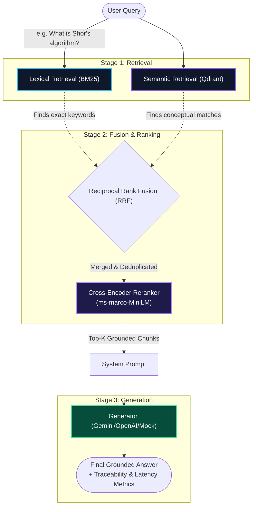

# HybridRAG Bench

**Production-grade Hybrid Retrieval-Augmented Generation System with Multi-Dimensional Evaluation**

> BM25 Lexical Retrieval · Qdrant Vector Store · Cross-Encoder Reranking · Automated 6-Dimension Evaluation · FastAPI · Streamlit Dashboard

---

## Key Results

Performance on the 12-query quantum computing benchmark (hybrid_rerank mode, top_k=5):

| Metric | BM25 Only | Dense Only | Hybrid | Hybrid + Reranker |
|---|---|---|---|---|
| Precision@1 | — | — | — | Run `--ablation` to populate |
| MRR | — | — | — | — |
| NDCG@5 | — | — | — | — |
| Semantic Similarity | — | — | — | — |
| Faithfulness Score | — | — | — | — |

> Run `python scripts/run_evaluation.py --ablation` to generate your own comparison table.

---

## What This Project Is

Most RAG tutorials show you how to point LangChain at a PDF and call it a day.  
This project solves the two problems that actually matter in production:

**Problem 1 — Dense-only retrieval fails on keyword-precise queries.**  
Proper nouns (`Feynman`, `Sycamore`), exact dates (`1981`, `2019`), and acronyms (`RSA`, `NMR`) are systematically under-represented in embedding spaces. A hybrid approach combining BM25 lexical search with dense semantic retrieval — fused via Reciprocal Rank Fusion and optimized by a cross-encoder reranker — is the industry-standard solution.

**Problem 2 — Most RAG systems ship with no systematic evaluation.**  
"It answered my test questions" is not evidence. This project implements a six-dimension automated evaluation framework (retrieval quality, answer correctness, faithfulness, entity recall, latency profiling, cost estimation) with ablation comparison and timestamped regression tracking.

---

## System Architecture



### Why Each Component Exists

| Component | What It Solves | Alternative Considered |
|---|---|---|
| **BM25** | Dense retrieval misses exact keyword matches | TF-IDF — rejected (no BM25 normalization) |
| **Qdrant** | FAISS has no persistence, filtering, or incremental updates | FAISS — rejected (not production-suitable) |
| **Cross-Encoder Reranker** | Bi-encoder retrieval ranking is approximate | LLM-based reranking — rejected (latency, cost) |
| **RRF Fusion** | BM25 and cosine scores are incomparable scales | Linear combination — rejected (scale-sensitive) |
| **Heuristic Faithfulness** | Detects hallucination without LLM API call overhead | RAGAS — available as future upgrade |

---

## Evaluation Framework

Six dimensions measured automatically on every evaluation run:

### Retrieval Quality
- **Precision@K** — Fraction of retrieved chunks that are relevant
- **Recall@K** — Fraction of relevant chunks found in top-K
- **MRR** — Mean Reciprocal Rank of the first relevant document
- **Hit Rate@K** — Did any relevant document appear in top-K?
- **NDCG@K** — Position-weighted relevance gain

### Generation Quality
- **ROUGE-1 / ROUGE-L** — Token and subsequence overlap with reference answer
- **Semantic Similarity** — Embedding cosine similarity (paraphrase-aware)
- **Entity Recall** — Fraction of key named entities from reference present in generated answer
- **Faithfulness Score** — Fraction of generated sentences semantically supported by retrieved context (hallucination proxy)

### Operational
- **Latency (p50 / p90 / p99)** — Per-stage wall-clock timing across all pipeline stages
- **Token Usage** — Input/output token counts per query
- **Cost Projection** — Monthly API cost estimate at 100/1K/10K queries per day

---

## Test Suite Structure

| Tier | Purpose | Count |
|---|---|---|
| **Tier 1: Direct Lookup** | Basic factual retrieval (names, dates, exact facts) | 4 questions |
| **Tier 2: Synthesis** | Multi-document cross-reference questions | 4 questions (Q09–Q12) |
| **Tier 3: Adversarial** | Trick questions, conflation traps, out-of-domain | 4 questions |
| **Tier 4: Robustness** | Paraphrases, typos, minimal/verbose queries | 4 questions |
| **Full Ground Truth** | Combined benchmark | 12 questions |

---

## Quick Start

### 1. Clone and Install

```bash
git clone https://github.com/YOUR_USERNAME/HybridRAG-Bench.git
cd HybridRAG-Bench

python -m venv venv
venv\Scripts\activate        # Windows
# source venv/bin/activate   # Mac/Linux

pip install -r requirements.txt
```

### 2. Configure

```bash
cp .env.example .env
# Edit .env — add your GOOGLE_API_KEY for real LLM generation
# Leave as mock for offline testing (no API key needed)
```

### 3. Run the Pipeline

```bash
# Test the end-to-end pipeline (mock mode — no API key needed)
python src/pipeline.py

# Run the full evaluation suite
python scripts/run_evaluation.py

# Run ablation comparison (all 4 retrieval modes)
python scripts/run_evaluation.py --ablation

# Launch the interactive dashboard
streamlit run dashboard/app.py

# Start the API server
python scripts/run_api.py
# → Docs at http://localhost:8000/docs
```

### 4. Run Tests

```bash
# Unit tests (fast, no index building required)
pytest tests/unit/ -v

# Integration tests (builds full pipeline in mock/dev mode)
pytest tests/integration/ -v

# Full test suite
pytest tests/ -v
```

### 5. Docker

```bash
# Copy and configure environment
cp .env.example .env  # add your API keys

# Build and start all services
docker-compose up --build

# API at http://localhost:8000/docs
# Dashboard at http://localhost:8501
```

---

## API Reference

### `GET /health`
```json
{
  "status": "healthy",
  "index_built": true,
  "chunk_count": 52,
  "provider": "gemini",
  "version": "2.0.0"
}
```

### `POST /v1/query`
```json
{
  "question": "Why did Shor's algorithm threaten RSA encryption?",
  "top_k": 5,
  "mode": "hybrid_rerank",
  "strict_grounding": true
}
```

**Response includes**: generated answer, retrieved chunks with individual scores (BM25, dense, RRF, reranker), confidence score, source doc IDs, per-stage latency, token usage.

### `POST /v1/evaluate`
Evaluate a single question against a reference answer — returns all 9 quality metrics.

### `GET /v1/index/stats`
Returns corpus statistics: chunk count, document list, embedding dimensions.

---

## Project Structure

```
HybridRAG-Bench/
├── configs/
│   ├── default.yaml          # All pipeline parameters (no hardcoded values in source)
│   └── dev.yaml              # Dev overrides (mock LLM, no reranker)
├── src/
│   ├── config.py             # Config management (YAML + env vars)
│   ├── logger.py             # Colorized structured logging
│   ├── pipeline.py           # End-to-end orchestrator
│   ├── chunking/
│   │   └── sentence_chunker.py   # Metadata-enriched sentence chunker
│   ├── retrieval/
│   │   ├── bm25_retriever.py     # BM25 lexical retrieval
│   │   ├── dense_retriever.py    # Qdrant dense vector retrieval
│   │   ├── hybrid_retriever.py   # RRF fusion + ablation modes
│   │   └── reranker.py           # Cross-encoder reranking
│   ├── generation/
│   │   └── generator.py          # Multi-provider generator (Gemini/OpenAI/Mock)
│   ├── evaluation/
│   │   ├── retrieval_metrics.py  # P@K, Recall@K, MRR, HitRate, NDCG
│   │   ├── generation_metrics.py # ROUGE, Semantic, Entity Recall, Faithfulness
│   │   ├── cost_estimator.py     # Token tracking + cost projection
│   │   └── suite_runner.py       # Full evaluation orchestrator
│   └── api/
│       ├── app.py                # FastAPI application
│       └── schemas.py            # Pydantic request/response models
├── dashboard/
│   └── app.py                # Streamlit evaluation dashboard
├── data/
│   ├── docs/                 # 8 hand-crafted quantum computing documents
│   ├── ground_truth.json     # 12-question benchmark (4 synthesis, 8 single-doc)
│   ├── test_suites/          # Adversarial + robustness test tiers
│   └── eval_results/         # Timestamped evaluation runs (regression tracking)
├── tests/
│   ├── unit/                 # Fast unit tests (metrics, chunker)
│   └── integration/          # Full pipeline integration tests
├── scripts/
│   ├── run_api.py            # API launcher
│   └── run_evaluation.py     # Evaluation CLI
├── docs/
│   └── architecture.md       # Design decisions and component rationale
├── .env.example              # Configuration template
├── configs/default.yaml      # Pipeline configuration
├── Dockerfile                # Production container
└── docker-compose.yml        # API + Dashboard services
```

---

## Configuration Reference

All parameters are in `configs/default.yaml`. Key settings:

```yaml
retrieval:
  embedding_model: "all-MiniLM-L6-v2"
  top_k_dense: 10          # Dense candidates before fusion
  top_k_bm25: 10           # BM25 candidates before fusion
  final_top_k: 5           # Final chunks after reranking
  fusion_strategy: "rrf"   # Reciprocal Rank Fusion
  rrf_k: 60                # RRF smoothing constant
  enable_reranker: true    # Toggle for ablation testing
  reranker_model: "cross-encoder/ms-marco-MiniLM-L-6-v2"

generation:
  provider: "gemini"        # "gemini" | "openai" | "mock"
  gemini_model: "gemini-2.0-flash"
  temperature: 0.1
  strict_grounding: true    # Enforce context-only answers
```

Override any parameter via `configs/dev.yaml` or environment variables.

---

## Evaluation Suite Commands

```bash
# Standard evaluation (hybrid_rerank mode, full ground truth)
python scripts/run_evaluation.py

# Ablation study: compare all 4 retrieval modes
python scripts/run_evaluation.py --ablation

# Evaluate specific test tier
python scripts/run_evaluation.py --suite tier3_adversarial

# Change retrieval mode and top-k
python scripts/run_evaluation.py --mode dense_only --top-k 3

# Force rebuild the vector index before evaluating
python scripts/run_evaluation.py --force-reindex
```

Results are saved to `data/eval_results/eval_<timestamp>.json` for regression tracking.

---

## Dataset

**Domain**: History of Quantum Computing  
**Corpus**: 8 hand-crafted documents (~450 words each), **zero content overlap** between documents — each covers a strictly bounded subtopic.

| Document | Coverage |
|---|---|
| DOC-1 | Feynman's 1981 quantum simulation proposal |
| DOC-2 | Deutsch's 1985 quantum Turing machine |
| DOC-3 | Shor's 1994 factoring algorithm and RSA impact |
| DOC-4 | Grover's 1996 quantum search algorithm |
| DOC-5 | Early quantum hardware: IBM NMR and D-Wave |
| DOC-6 | Quantum error correction and the no-cloning theorem |
| DOC-7 | Superconducting hardware milestones (2000–2015) |
| DOC-8 | Google's 2019 quantum supremacy claim (Sycamore) |

**Ground Truth**: 12 Q&A pairs — 8 single-document, 4 multi-hop synthesis questions requiring evidence from two separate documents.

---

## Technical Decisions

**Why not LangChain or LlamaIndex?**  
Framework abstractions hide the engineering decisions that matter for interviews and production. Every component here is built from first principles using lightweight libraries (`rank_bm25`, `qdrant-client`, `sentence-transformers`). The architecture is transparent, auditable, and demonstrably understood.

**Why Reciprocal Rank Fusion over linear score combination?**  
BM25 produces term-frequency-based integer scores; cosine similarity produces floats in [-1, 1]. These scales are incompatible for direct addition. RRF uses rank positions instead of scores, making it robust to distribution differences between retrievers.

**Why heuristic faithfulness over LLM-as-judge?**  
LLM-as-judge faithfulness is the gold standard but adds latency and cost to every evaluation run. The heuristic (semantic sentence-level similarity against retrieved context) serves as a fast proxy for development and offline evaluation. LLM-as-judge can be dropped in as the `EVAL_JUDGE` config.

---

## Lessons Learned

**1. The Evaluation Flaw Pattern** — Grading RAG groundedness on trivia-recall questions is invalid. A model can retrieve the correct document but fail the grounding rubric because the question has only one specific factual answer. Evaluation questions must demand *thematic synthesis*, not trivia lookup. This drove the redesign of the ground truth toward multi-hop synthesis questions.

**2. Score Scale Incompatibility** — Attempting to combine BM25 and cosine similarity scores linearly produced unstable results because their distributions differ fundamentally. RRF's rank-based approach solved this without requiring learned fusion weights.

**3. Perfect Metrics on Small Datasets Are Meaningless** — P@1 = 1.00 and MRR = 1.00 on 12 questions from an 8-document corpus with zero overlap guarantees is not evidence of system quality. The adversarial and robustness test tiers were added specifically to surface real failure modes that perfect scores on the base benchmark conceal.

---

## Future Work

- [ ] LLM-as-judge faithfulness evaluation (Gemini/GPT-4o as authoritative judge)
- [ ] Parent-child chunking (retrieve small chunks, expand for context)
- [ ] Query decomposition (break multi-hop questions into sub-queries)
- [ ] OpenTelemetry tracing for distributed pipeline observability
- [ ] RAGAS framework integration for standardized metric comparison
- [ ] Human feedback loop (capture ratings, analyze failure patterns)
- [ ] PDF/DOCX multi-format document ingestion

---

## License

MIT License — see [LICENSE](LICENSE)
